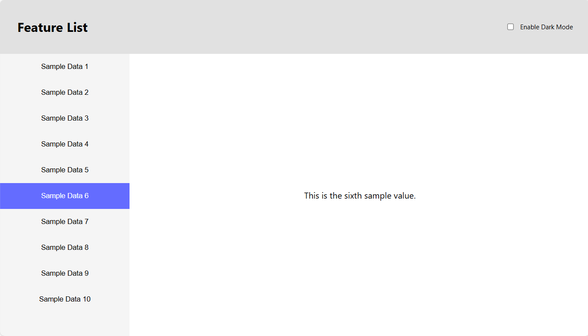

# Test Technique React - Évaluation Frontend

## Contexte

Ce test technique évalue vos compétences en développement React/TypeScript. Vous allez développer une application de liste de fonctionnalités avec menu de navigation et gestion de thème.

**Durée estimée** : 45 minutes

## Objectifs

Créer une application React/TypeScript avec les fonctionnalités suivantes :

### 1. Chargement de données
- Récupérer les données depuis `/public/api/data.json` au montage de l'application
- Les données contiennent des éléments avec `id`, `name` et `description`

### 2. Interface utilisateur
- **En-tête** : Titre "Feature List" + toggle pour changer de thème (clair/sombre)
- **Menu latéral** : Liste des éléments cliquables
- **Zone de contenu** : Affichage de la description de l'élément sélectionné

### 3. Gestion de l'état global
Utiliser le Context API de React pour gérer :
- Le thème actuel (`light` ou `dark`)
- La liste des éléments chargés
- L'élément actuellement sélectionné

### 4. Interactions
- Cliquer sur un élément du menu affiche sa description
- L'élément sélectionné est visuellement mis en surbrillance
- Le toggle de thème applique instantanément le nouveau thème à toute l'application

### 5. Styles
- Utiliser les CSS Modules fournis pour tous les composants

### 6. Maquette

## Technologies

- React
- TypeScript
- clsx (gestion des classes conditionnelles)

## Bonus optionnels

- Persistance du thème dans le localStorage
- Tests unitaires appropriés
